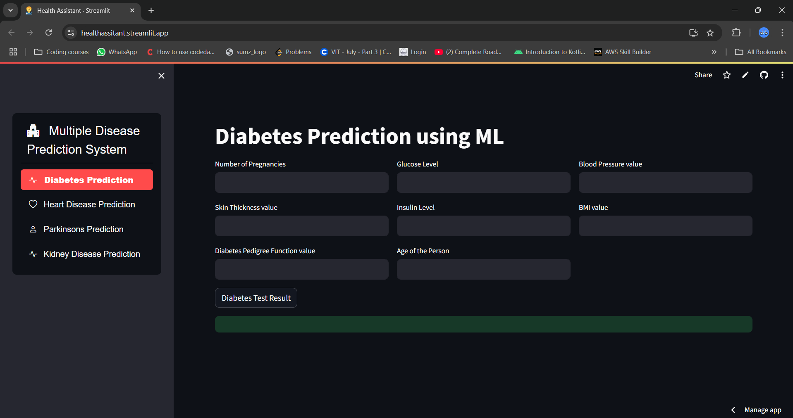
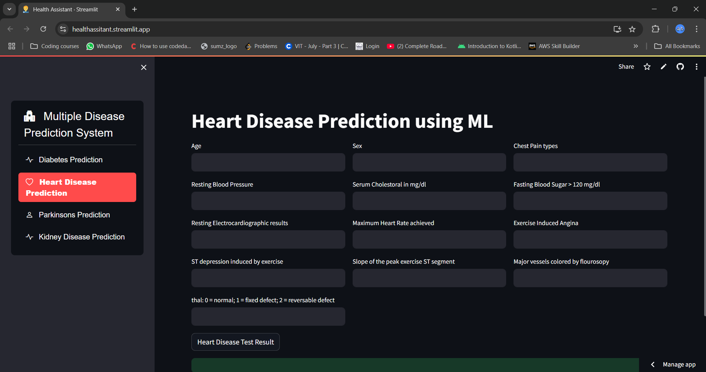
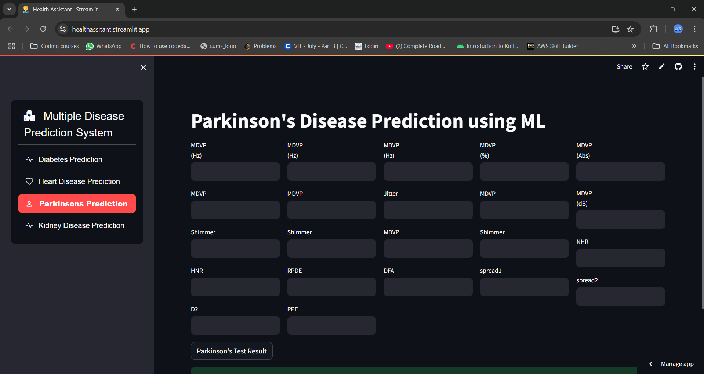
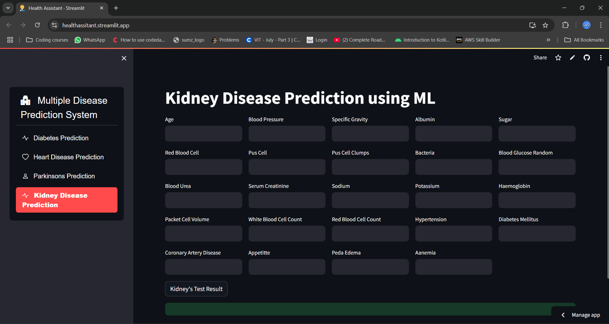
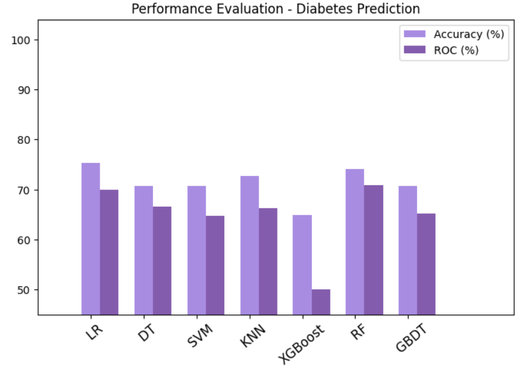
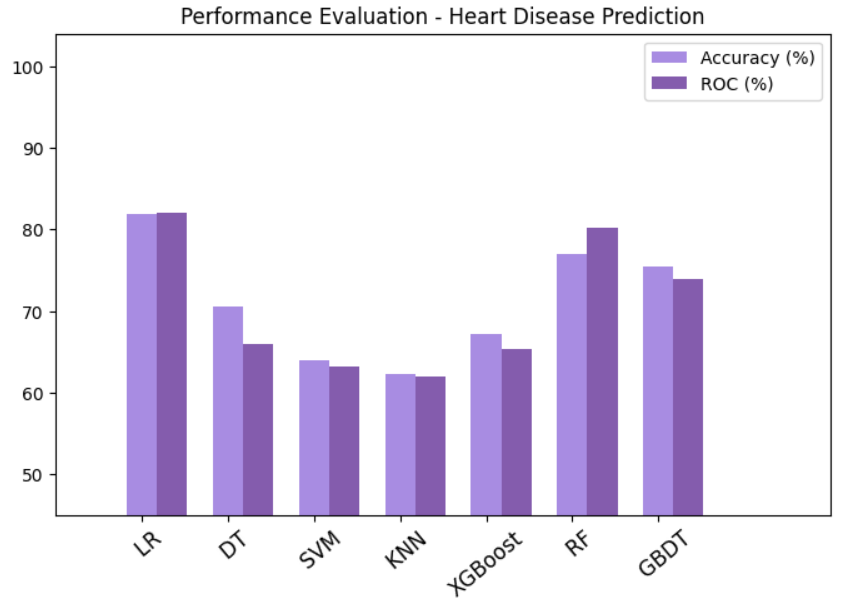
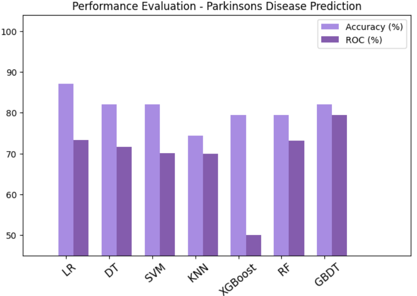
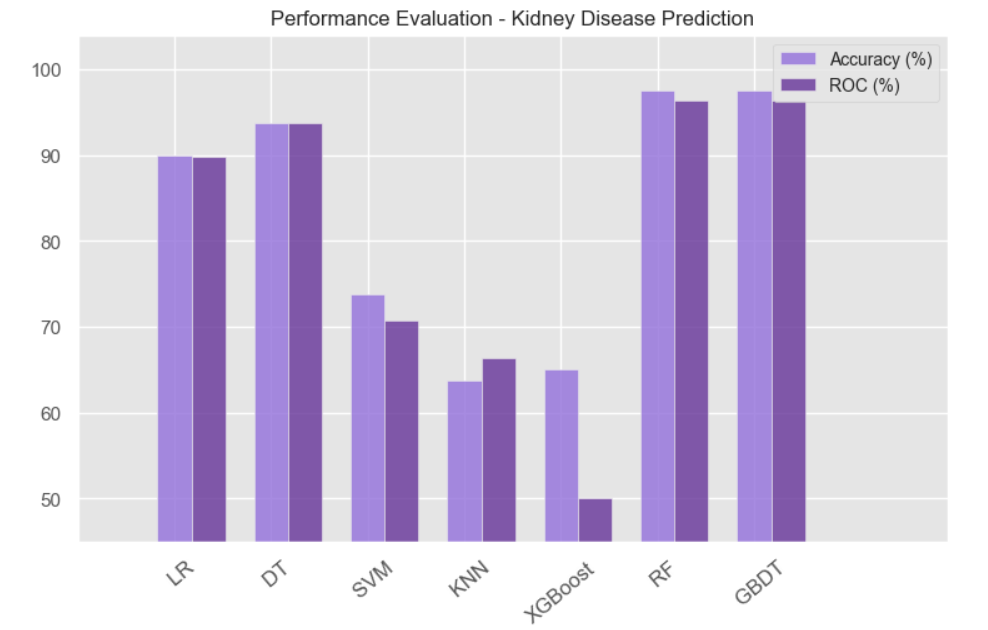

# Digi Diagnosis
This web application predicts the likelihood of various health conditions, including diabetes, heart disease, Parkinson's disease, and kidney disease, using machine learning algorithms. Users can input their health data to receive accurate predictions and insights. The app features a user-friendly interface, powered by a Streamlit and ML models using scikit-learn. It supports multiple disease predictions, providing a comprehensive health assessment tool. Easy to set up and use, it offers a valuable resource for early health risk detection.

> [!IMPORTANT]  
> To see the live Click here [demo](https://healthassitant.streamlit.app/)


     

## Table of contents
- [Features](#features)
- [Getting Started](#getting-started)
  - [Prerequisites](#prerequisites)
  - [Installation](#installation)
  - [Running the Application](#running-the-application)
- [Usage](#usage)
- [Results](#results)
- [Technologies Used](#technologies-used)
- [Machine Learning Algorithms Used](#machine-learning-algorithms-used)
- [Contributing](#contributing)
- [License](#license)

## Features
- **User-Friendly Interface**: A clean and intuitive UI for users to input their data and receive predictions.
- **Multiple Disease Predictions**: Supports predictions for multiple diseases in one platform.
- **Machine Learning Models**: Powered by well-trained ML models for accurate predictions.

## Getting Started

### Prerequisties
Before you begin please make sure to install this prerequisities
-Python (>3 version)
-Jupyter Notebook or Google colab
-Vs code or similar IDE'S

### Installation
1. Clone the repository
   ```
   git clone https://github.com/SandeepGarikapati/health-assitant.git

   ```
2. Install the Dependencies
   ```
   pip install -r requirements.txt
   
   ```

### Running the Application
1. Run the Streamlit app:
```bash
streamlit run app.py
```
2. Open the link in any browser to see the results.

## Usage
1. Diabetes Prediction



2. Heart Disease Prediction
   


3. Parkinsons Disease Prediction



4. Kidney Disease Prediction



## Results
1. Diabetes



2. Heart
   


3. Parkinsons
   


4. Kidney
   



## Technologies Used

- Python
- Streamlit
- Scikit-learn
- ML models (Logistic Regression,SVC,KNN, Decision Tree Clasifier, Random Forest Classifier, XGBoost Classifier)

## Machine Learning Algorithms Used
- **Logistic Regression**: Used for binary classification problems, providing probabilistic outputs.
- **Support Vector Classifier (SVC)**: Effective in high-dimensional spaces, particularly for small datasets.
- **K-Nearest Neighbors (KNN)**: A non-parametric algorithm that classifies data points based on proximity.
- **Decision Tree Classifier**: A tree-based model that splits the dataset based on feature importance.
- **Random Forest Classifier**: An ensemble model that improves accuracy by combining multiple decision trees.
- **XGBoost Classifier**: A gradient boosting algorithm that enhances model performance with faster computation.
- **Gradient Boosting Decision Tree (GBDT)**: A sequential ensemble method that minimizes prediction errors.

## Contributing

Contributions are welcome! Please follow these steps:

1. Fork the repository.
2. Create a new branch (`git checkout -b feature/your-feature-name`).
3. Make your changes.
4. Commit your changes (`git commit -m 'Add some feature'`).
5. Push to the branch (`git push origin feature/your-feature-name`).
6. Open a pull request.

## License

This project is licensed under the MIT License. See the [LICENSE](LICENSE) file for details.

---

Thank you for using Health Assistant, Stay Healthy, Stay Happy!

